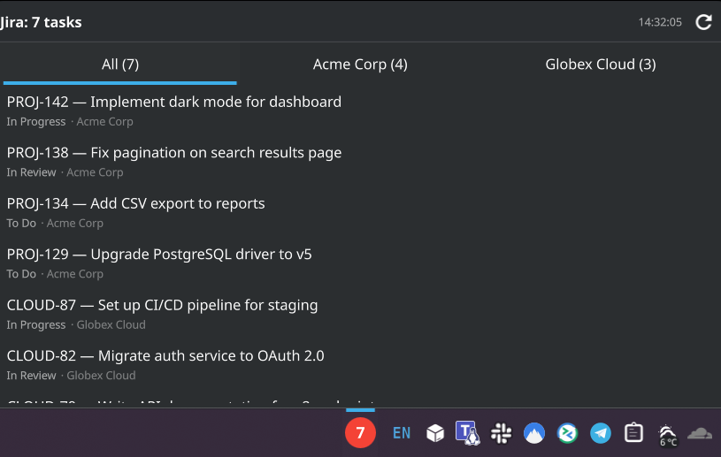
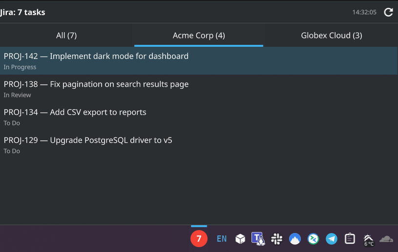

<p align="center">
  
</p>

# jira-tray

A lightweight Jira task monitor that lives in your KDE Plasma system tray. It polls one or more Jira instances for assigned tasks and displays them as a badge widget with a popup list.

## Screenshots

| All tasks | Filter by instance |
|---|---|
|  |  |

## Architecture

```
┌──────────────┐  REST API   ┌──────────────┐
│ Plasma Widget│ ◄──────────► │ Jira Server  │
│ (QML)        │              │ Jira Cloud   │
└──────────────┘              └──────────────┘
```

The widget talks directly to Jira — no backend process needed. Everything runs as a single `.plasmoid` file.

## Requirements

- KDE Plasma 6

## Install from KDE Store

1. Download `com.github.aladex.jira-tray.plasmoid` from the [KDE Store](https://store.kde.org/) or [GitHub Releases](https://github.com/Aladex/jira-tray/releases)
2. Install: `kpackagetool6 -i com.github.aladex.jira-tray.plasmoid`
3. Add the **Jira Tasks** widget to your panel or system tray
4. Right-click the widget and choose **Configure...** to add your Jira instances

## Build from source

```bash
git clone https://github.com/Aladex/jira-tray.git
cd jira-tray
make install
```

Add the **Jira Tasks** widget to your panel or system tray, then right-click it and choose **Configure...** to add your Jira instances.

## Configuration

The widget has a built-in settings page (right-click the widget > Configure) that supports multiple Jira instances. For each instance you can set:

- **Name** — display name for the instance
- **Jira URL** — base URL of your Jira instance
- **Email (Cloud)** — your Atlassian account email; leave empty for Server/DC
- **API Token** — personal access token
- **JQL Filter** — custom JQL query
- **Poll Interval** — how often to check for updates (`30s`, `2m`, `10m`, etc.)

### Authentication

Auth type is auto-detected per instance:

| Email field | Auth method | Use case |
|---|---|---|
| Filled | Basic (`email:token`) | Jira Cloud |
| Empty | Bearer (`token`) | Jira Server / Data Center |

## Uninstall

```bash
make uninstall
```

Or via kpackagetool:

```bash
kpackagetool6 -r com.github.aladex.jira-tray
```

## License

MIT
